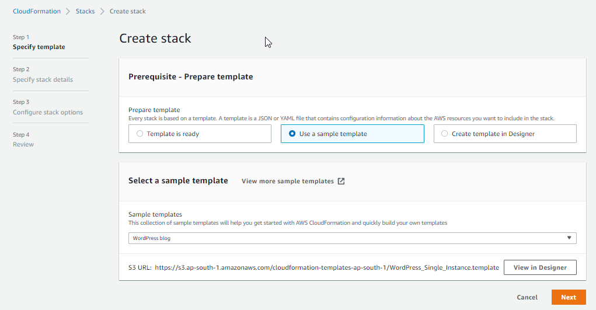
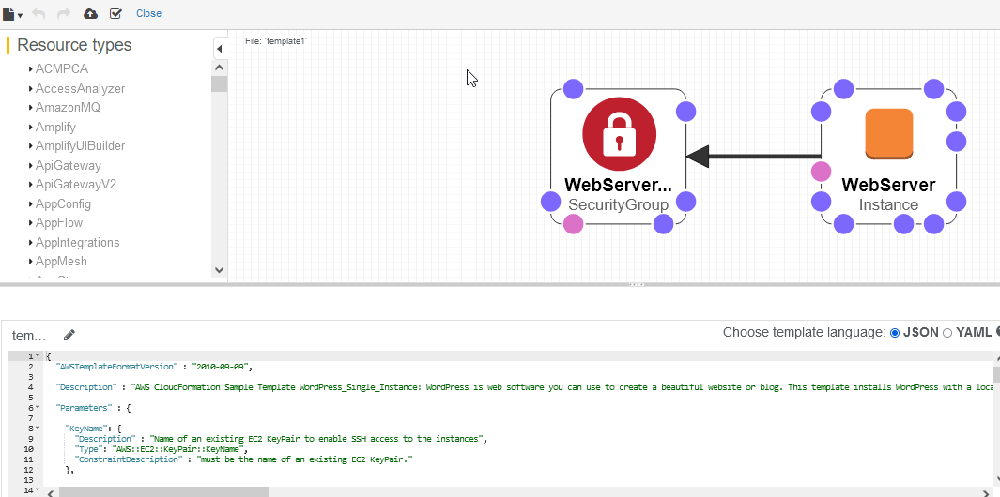
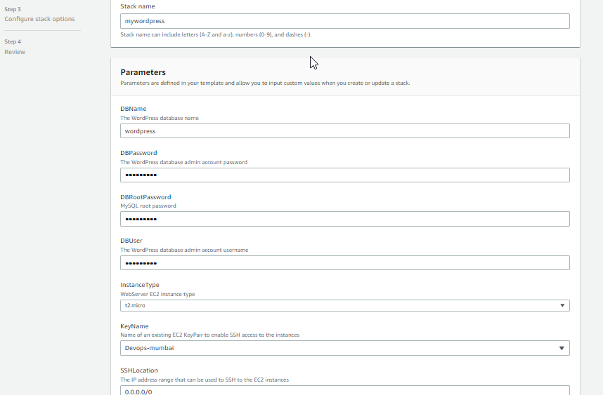
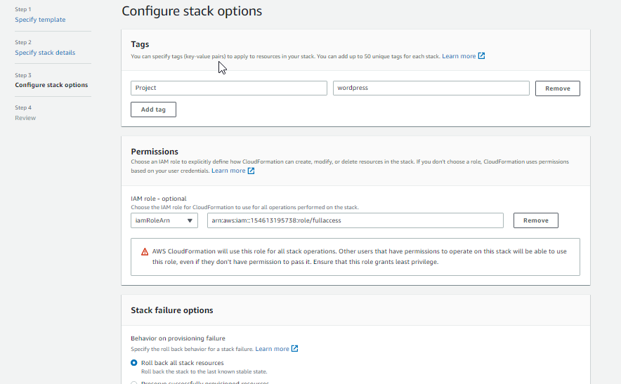
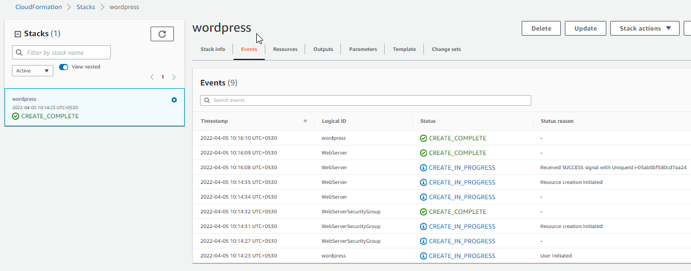
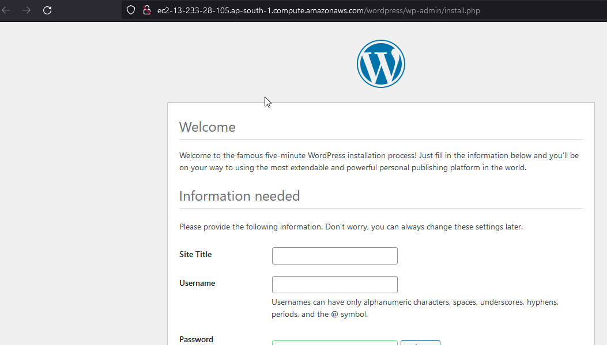
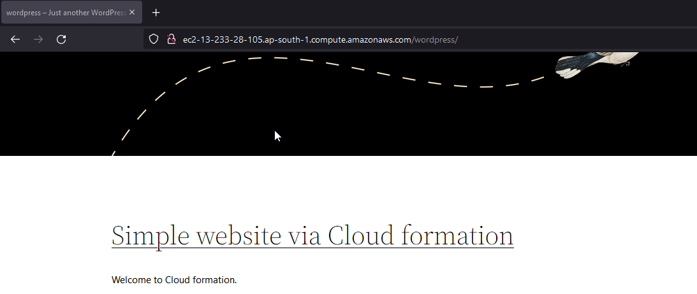

# wordpress-setup-using-cloudformation


[](https://travis-ci.org/joemccann/dillinger)

## Description

AWS CloudFormation Sample Template WordPress_Single_Instance: WordPress is web software you can use to create a beautiful website or blog. This template installs WordPress with a local MySQL database for storage. It demonstrates using the AWS CloudFormation bootstrap scripts to deploy WordPress. **WARNING** This template creates an Amazon EC2 instance. 

## Pre-Requests
```
Basic knowledge on AWS, cloudformation , s3 and wordpress
```

> Creation of stack using the basic wordpress stack templates
<center> </img></center>

> Design of selected wordpress blog infra on Cloudformation
<center> </img></center>

> Moving to next part, provide the db details such as name and user pass for the creation
<center> </img></center>

> CONFIGURING the stack tags and role attaching
<center> </img></center>

> Stack creation started and inprogress
<center> </img></center>

> Stack creation completed and EC2 and s3 deployed as the part of template we have selected
<center> </img></center>

> S3 URL for verify that the wordpress has been installed or not
<center> </img></center>

> Verfied the site that wordpress is working fine
<center> </img></center>

> Site working fine and you can chnage or setup wordpress as your own wish.
<center> </img></center>

## Conclusion

Deployed my wordpress website via AWS Cloudformation templates

#### ⚙️ Connect with Me

<p align="center">
<a href="mailto:jomyambattil@gmail.com"></a>
<a href="https://www.linkedin.com/in/jomygeorge11"></a> 
<a href="https://www.instagram.com/therealjomy"></a><br />
